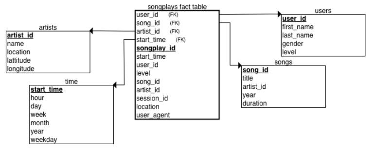

Project 3: Data Warehouse with Amazon Redshift
===========================

Udacity Data Engineer Nanodegree project
----------------------------------------

### Issue to solve in the project

An imagined music streaming startup named Sparkify has grown their user base and song database and now want to take their processes and data to the cloud. Their data are in S3, in a directory of JSON logs on user activity on the app, as well as a directory with JSON metadata on the songs in their app.

The project creates an ETL process that extracts data from S3, stages them in Redshift, and transforms data into a set of dimensional tables for their analytics team to continue finding insights in what songs their users are listening to.

### Schema design and ETL pipeline

The star schema has 1 fact table (songplays), and 4 dimension tables (artists, songs,  time, users).

The project is based on two Amazon Web Services: S3 (Data storage) and Redshift (Data warehouse with columnar storage).

Data sources are provided by two public S3 buckets:

`Song data: s3://udacity-dend/song_data`

`Log data: s3://udacity-dend/log_data`

Song data bucket contains info about songs and artists. Log data bucket has info concerning actions done 
by users (f.ex. which song they are listening). The objects contained in both buckets are JSON files. 

The Redshift service is where data are ingested and transformed, access to the JSON files inside provided though COPY command. The song bucket has all the files under the same directory but the second one do not.

In this project the main pillar of ETL is SQL with Python used as bridge.

### Hot to run

1. Set up a config file **dwh.cfg**. Put in the information for your Redshift cluster and IAM-Role that can manage your cluster and read S3 buckets.

2. After initial terminal session, set filesystem on project root folder, then insert below commands in order to run: 
`python create_tables.py`

3. Entry point of the program. Read the database credentials from the config file, connects to the database, loads the S3 files into sage tables, loads the final tables from stage tables and optionally closes the database connection if needed:
`python etl.py`

### Files

**create_tables.py** - drop old tables (if exist) ad re-create new tables

**etl.py** - execute queries that extract JSON data from the S3 bucket and ingest them to Redshift

**sql_queries.py** - variables with SQL queries, partitioned by CREATE, DROP, COPY and INSERT statements

**dhw.cfg** - configuration file that contains info about Redshift, IAM and S3
